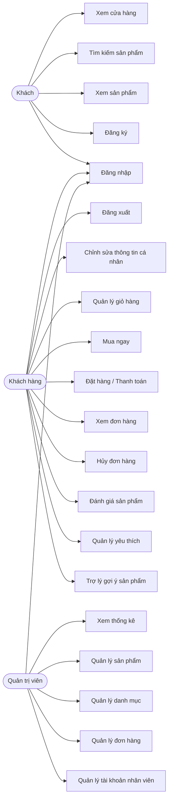
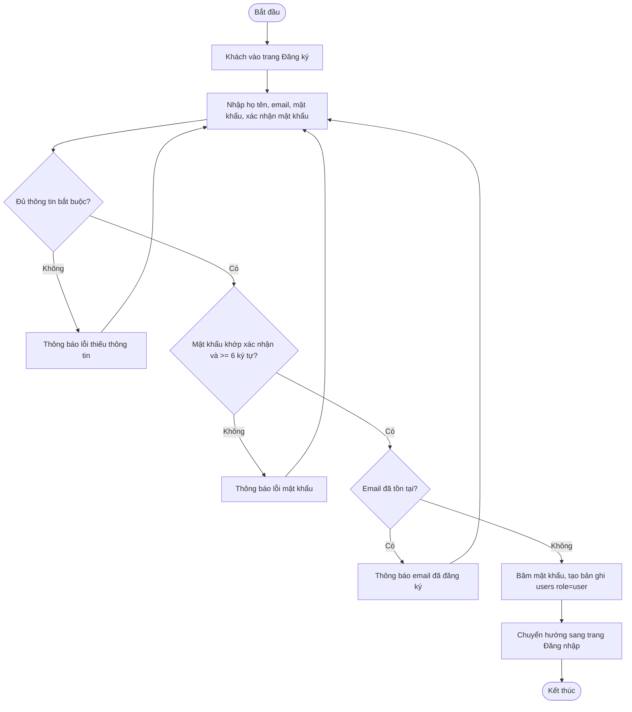
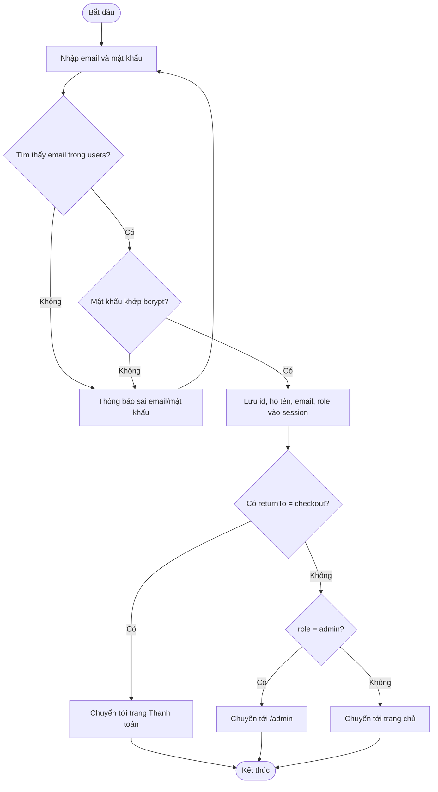
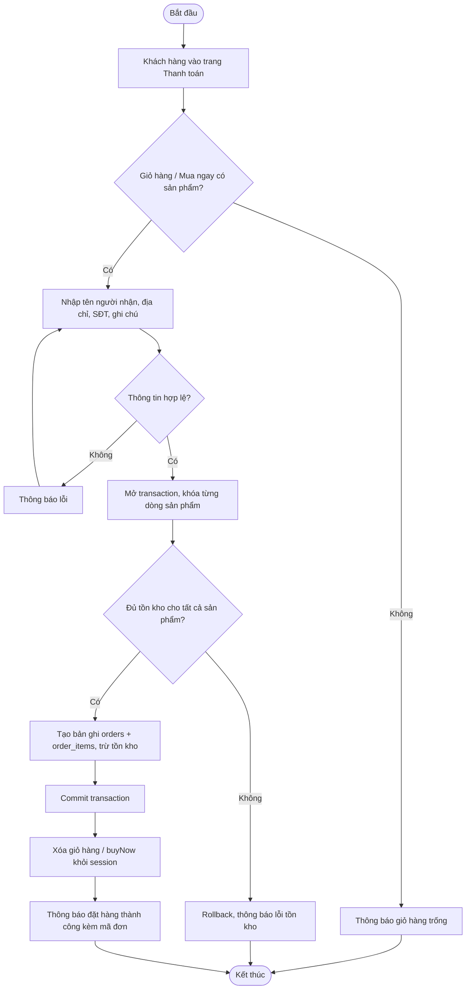
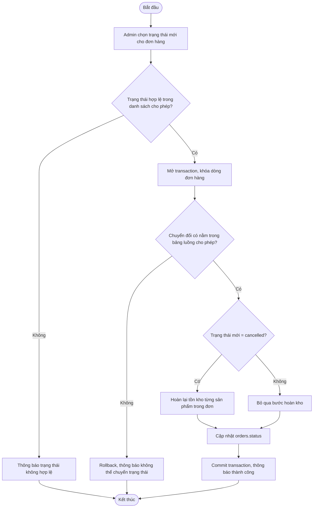
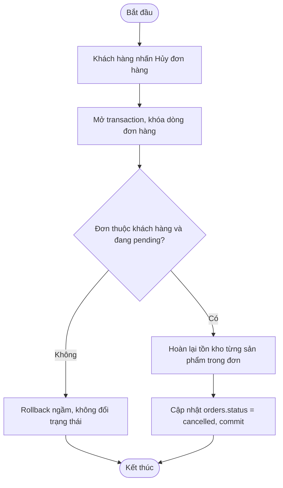

# ĐẶC TẢ HỆ THỐNG — WEBSITE BÁN ĐỒ ĐIỆN TỬ (ELECTROSHOP)

> Tài liệu được xây dựng dựa trên **khảo sát mã nguồn thực tế** tại repo
> [`nguyentrong-thai/TTCSN`](https://github.com/nguyentrong-thai/TTCSN)
> (Node.js + Express + EJS + MySQL), áp dụng **cách phân tích và trình bày use case**
> tham khảo từ báo cáo mẫu của Nhóm 16 (đề tài cùng chủ đề "Xây dựng website bán đồ điện tử").
> Cấu trúc gồm: (1) Khảo sát & yêu cầu, (2) Biểu đồ/danh sách use case, (3) Đặc tả chi tiết
> từng use case, (4) Luồng hoạt động (activity flow) của các nghiệp vụ chính.

---

## 1. KHẢO SÁT HỆ THỐNG

> Tài liệu này được cập nhật theo mã nguồn thực tế đang có trong repo. Mục tiêu là phản ánh đúng
> các chức năng đã triển khai, thay vì mô tả một hệ thống lý tưởng chưa được xây dựng.

### 2.1.2. Tài liệu đặc tả người dùng

#### a) Khảo sát chi tiết

##### Các hoạt động của hệ thống

- Quản lý sản phẩm:
  - Admin cần đăng nhập vào hệ thống.
  - Tìm kiếm sản phẩm theo tên, giá, số lượng tồn. Với những sản phẩm cần thay đổi thông tin, admin click vào biểu tượng sửa để cập nhật thông tin như tên, mô tả, số lượng, giá, và các thuộc tính cần thiết.
  - Mỗi khi có hàng mới nhập về, admin có thể tạo mới sản phẩm để hiển thị lên trang web cho khách hàng xem và mua.

- Quản lý tài khoản:
  - Admin cần đăng nhập vào hệ thống.
  - Admin có thể sửa thông tin tài khoản nhân viên hoặc xóa tài khoản.
  - Admin có thể tạo mới tài khoản, thay đổi quyền nhân viên bằng cách chọn vai trò `role` cho nhân viên.

- Quản lý đơn hàng:
  - Admin cần đăng nhập vào hệ thống.
  - Admin có thể tìm kiếm theo thông tin hóa đơn, cập nhật trạng thái hóa đơn; trạng thái mặc định khi khách hàng đặt hàng là `chờ duyệt`.
  - Admin có thể xem chi tiết hóa đơn, bao gồm thông tin khách hàng, sản phẩm đặt mua và thông tin hóa đơn.
  - Admin cũng có thể xóa hóa đơn.
  - Admin có thể tìm kiếm, sửa thông tin và tạo mới thông tin.

- Đăng nhập:
  - Để đăng nhập, người dùng cần có tài khoản của trang web. Khi truy cập vào trang web, người dùng click vào nút “Đăng nhập”; nếu truy cập vào trang không thuộc quyền, hệ thống sẽ hiển thị màn hình đăng nhập và yêu cầu người dùng đăng nhập.
  - Người dùng nhập thông tin và click “Đăng nhập”. Hệ thống sẽ hiển thị màn hình trang chủ theo quyền truy cập của tài khoản.

- Đăng ký:
  - Người dùng có thể tự tạo tài khoản cho mình để truy cập website với quyền là `user`.
  - Click vào nút “Đăng ký” để hệ thống hiển thị màn hình tạo tài khoản; sau khi điền đầy đủ thông tin, người dùng click nút “Đăng ký” để xác nhận.

- Xem cửa hàng:
  - Khách hàng truy cập vào đường link trang web của cửa hàng. Hệ thống hiển thị trang chủ của cửa hàng ra màn hình.

- Tìm kiếm sản phẩm:
  - Khách hàng có thể tìm kiếm sản phẩm bằng cách truy cập vào trang web; danh mục sản phẩm sẽ được hiển thị. Ở trang chủ hiển thị một số sản phẩm giới thiệu hoặc các sản phẩm bán chạy.
  - Khách hàng cũng có thể truy cập trực tiếp vào danh mục sản phẩm để xem nhiều sản phẩm hơn, tìm kiếm theo tên, giá sản phẩm.
  - Khi đã chọn được sản phẩm ưng ý, khách hàng có thể click vào sản phẩm để xem chi tiết.

- Chỉnh sửa thông tin cá nhân:
  - Khách hàng click vào “Tài khoản của tôi” trong danh sách vừa xuất hiện. Hệ thống hiển thị form thông tin tài khoản của khách hàng lên màn hình.
  - Chỉnh sửa thông tin đăng ký tài khoản: khách hàng nhập email, mật khẩu, xác nhận mật khẩu và ấn “Lưu”. Hệ thống cập nhật thông tin đăng ký tài khoản và hiển thị thông báo đã cập nhật.
  - Chỉnh sửa thông tin liên hệ: khách hàng nhập họ và tên, số điện thoại, tên hồ sơ và ấn “Lưu”. Hệ thống sửa thông tin liên hệ và hiển thị thông báo đã cập nhật.
  - Chỉnh sửa địa chỉ giao hàng/thanh toán: khách hàng nhập họ và tên, điện thoại, địa chỉ, tỉnh/thành, quận/huyện, phường/xã và ấn “Lưu”. Hệ thống cập nhật địa chỉ và hiển thị thông báo đã cập nhật.

- Xem sản phẩm:
  - Khách hàng kích vào một danh mục bất kỳ trong danh sách các danh mục. Hệ thống sẽ lấy thông tin các sản phẩm lên màn hình.
  - Khách hàng kích vào ảnh minh họa của một sản phẩm bất kỳ trong danh sách. Hệ thống hiển thị thông tin chi tiết của sản phẩm được chọn.

- Quản lý giỏ hàng:
  - Khách hàng cần đăng nhập vào hệ thống.
  - Sau khi chọn sản phẩm, khách hàng chọn số lượng và click vào “Thêm giỏ hàng”. Sản phẩm sẽ được thêm vào giỏ hàng của khách hàng.
  - Trong giỏ hàng, hệ thống hiển thị danh mục sản phẩm khách hàng đã đặt mua; khách hàng có thể thay đổi số lượng hoặc xóa sản phẩm khỏi giỏ hàng. Hệ thống tự động tính tổng tiền tương ứng.

- Mua hàng:
  - Khách hàng cần đăng nhập vào hệ thống.
  - Sau khi đã có một số lượng sản phẩm trong giỏ hàng, khách hàng có thể đặt hàng bằng cách click vào nút thanh toán; hệ thống tự động cập nhật hóa đơn mới vào danh mục hóa đơn của admin quản lý. Mọi thông tin sản phẩm trong giỏ hàng sẽ được xóa khỏi giỏ hàng sau khi đặt hàng thành công.

- Xem đơn hàng:
  - Khách hàng chọn “Đơn hàng” trong danh mục. Hệ thống lấy thông tin các đơn hàng của khách hàng và hiển thị lên màn hình.

- Hủy đơn hàng:
  - Sau khi đã đặt hàng, khách hàng click vào nút hủy; hệ thống hiển thị xác nhận hủy đơn hàng. Khi xác nhận, hệ thống sẽ xóa toàn bộ thông tin đơn hàng đã đặt.

#### b) Yêu cầu chức năng

- Khách hàng có thể vào xem, tìm kiếm, đăng nhập, đăng ký, chỉnh sửa thông tin cá nhân, quản lý giỏ hàng, mua hàng, xem đơn hàng và hủy đơn hàng.
- Người quản trị có thể đăng nhập, quản lý sản phẩm của cửa hàng, quản lý tài khoản nhân viên, quản lý danh mục, quản lý đơn hàng và quản lý một số thông tin trang web.

#### c) Yêu cầu phi chức năng

- Giao diện dễ nhìn, dễ hiểu, thao tác nhanh gọn; bất cứ ai vào mua hàng cũng có thể thực hiện được.
- Ổn định, xử lý nhanh. Tốc độ tải trang hay thực hiện công việc không được quá lâu; cần có các trạng thái rõ ràng khi thực hiện xong một công việc nào đó.
- Tương thích với các trình duyệt và các thiết bị khác nhau.
- An toàn và bảo mật: đảm bảo an toàn thông tin cho người dùng; các thao tác nghiệp vụ của người quản trị thực hiện được khi có quyền.

### 1.1. Khảo sát sơ bộ — Tổ chức và tác nhân (actor)

Hệ thống đang triển khai 3 nhóm người dùng chính, tương ứng với cột `role` trong bảng `users`
(`user`, `employee`, `admin`) và với logic kiểm tra quyền trong middleware:

- **Khách (Guest / chưa đăng nhập):** duyệt trang chủ, xem danh sách và chi tiết sản phẩm, tìm
  kiếm/lọc sản phẩm, dùng trợ lý gợi ý, đăng ký, đăng nhập, xem trang hỗ trợ. Khách cũng có thể
  thêm sản phẩm vào giỏ hàng, nhưng khi thanh toán bắt buộc phải đăng nhập.
- **Khách hàng (role = `user`):** có toàn bộ quyền của Khách, cộng thêm: chỉnh sửa thông tin cá
  nhân, quản lý giỏ hàng, mua ngay, đặt hàng, xem đơn hàng, hủy đơn khi còn ở trạng thái
  `pending`, đánh giá sản phẩm sau khi đã mua và nhận hàng thành công, quản lý wishlist.
- **Quản trị viên (role = `admin`):** truy cập vào khu vực `/admin`; quản lý sản phẩm, danh mục,
  đơn hàng, tài khoản nhân viên; xem thống kê tổng quan.

> **Ghi chú khảo sát quan trọng:** Vai trò `employee` đã tồn tại trong CSDL và có màn hình
> tạo/sửa/xóa tài khoản nhân viên, nhưng middleware hiện tại chỉ kiểm tra `role === 'admin'`.
> Vì vậy, trong thực tế, `employee` chưa có khu vực chức năng riêng và chưa được cấp quyền nghiệp vụ
> khác ngoài việc được quản trị viên quản lý như một tài khoản hệ thống.

### 1.2. Yêu cầu chức năng thực tế của hệ thống

**Đối với Khách / Khách hàng:**
1. Xem trang chủ và danh sách sản phẩm theo danh mục.
2. Tìm kiếm sản phẩm theo tên/thương hiệu, lọc theo danh mục và hãng.
3. Xem chi tiết sản phẩm: mô tả, giá, tồn kho, đánh giá trung bình, danh sách đánh giá.
4. Đăng ký tài khoản khách hàng mới.
5. Đăng nhập / đăng xuất.
6. Chỉnh sửa thông tin cá nhân (họ tên, số điện thoại, địa chỉ, giới tính, ngày sinh).
7. Thêm, cập nhật số lượng và xóa sản phẩm khỏi giỏ hàng.
8. Mua ngay một sản phẩm (không cần thêm vào giỏ hàng chung).
9. Đặt hàng: nhập thông tin người nhận và xác nhận đơn hàng; hệ thống tạo đơn và trừ tồn kho.
10. Xem danh sách và chi tiết các đơn hàng đã đặt.
11. Hủy đơn hàng khi đơn còn ở trạng thái `pending`.
12. Đánh giá sản phẩm sau khi đã mua và nhận hàng thành công.
13. Quản lý danh sách yêu thích thêm/xóa sản phẩm.
14. Trò chuyện với trợ lý gợi ý sản phẩm bằng từ khóa hoặc ngân sách.

**Đối với Quản trị viên:**
15. Đăng nhập vào khu vực quản trị và xem thống kê tổng quan.
16. Thêm/sửa/ẩn sản phẩm; ẩn sản phẩm bằng cách cập nhật `is_active = 0` thay vì xóa vật lý.
17. Tải ảnh lên cho sản phẩm, tự resize và chuyển định dạng WebP bằng `sharp`.
18. Thêm/sửa/xóa danh mục sản phẩm.
19. Xem danh sách, chi tiết và cập nhật trạng thái đơn hàng theo luồng hợp lệ.
20. Thêm/sửa/xóa tài khoản nhân viên.

### 1.3. Yêu cầu phi chức năng thực tế

- **Bảo mật:** mật khẩu được băm bằng `bcrypt`; form có CSRF (`csurf`); giới hạn tần suất đăng
  nhập/đăng ký bằng `express-rate-limit` (20 request/15 phút); bảo vệ header với `helmet`.
- **Tải lên file:** dung lượng body giới hạn 100kb, dung lượng ảnh tối đa 5MB, chỉ chấp nhận
  `.jpg/.jpeg/.png/.webp`.
- **Toàn vẹn dữ liệu:** các thao tác liên quan đến tồn kho và đơn hàng (đặt hàng, hủy đơn, cập nhật
  trạng thái) thực hiện trong transaction MySQL và có cơ chế khóa dòng khi cần.
- **Hiệu năng:** phân trang cho danh sách sản phẩm, đơn hàng, nhân viên; chỉ có vài index quan trọng
  trên các trường truy vấn chính.
- **Ràng buộc dữ liệu:** email và các dữ liệu khóa riêng có tính duy nhất; mỗi khách hàng chỉ lưu
  được một đánh giá cho mỗi sản phẩm; mỗi sản phẩm chỉ xuất hiện một lần trong giỏ hoặc wishlist của
  cùng một khách hàng.
- **Hạn chế hiện tại của hệ thống:** chưa tích hợp thanh toán trực tuyến; giỏ hàng được lưu trong
  session nên sẽ mất khi hết phiên / vừa đóng trình duyệt; vai trò `employee` chưa có khu vực chức
  năng riêng; hệ thống hiện chưa có module nhân viên vận hành riêng ngoài admin.

---
---

## 2. PHÂN TÍCH USE CASE

### 2.1. Actor

| Actor | Vai trò trong hệ thống |
|---|---|
| Khách (Guest) | Người dùng chưa đăng nhập, duyệt và tìm hiểu sản phẩm |
| Khách hàng (Customer, `role=user`) | Đã đăng nhập, thực hiện các nghiệp vụ mua sắm |
| Quản trị viên (Admin, `role=admin`) | Quản lý toàn bộ sản phẩm, danh mục, đơn hàng, nhân viên |

### 2.2. Danh sách use case theo actor

- **Khách hàng (Customer):**
  Xem trang chủ/cửa hàng · Tìm kiếm & lọc sản phẩm · Xem chi tiết sản phẩm · Đăng ký · Đăng nhập ·
  Đăng xuất · Chỉnh sửa thông tin cá nhân · Quản lý giỏ hàng · Mua ngay · Đặt hàng (thanh toán) ·
  Xem đơn hàng · Hủy đơn hàng · Đánh giá sản phẩm · Quản lý danh sách yêu thích · Tư vấn sản phẩm
  bằng trợ lý ảo.
- **Quản trị viên (Admin):**
  Đăng nhập quản trị (dùng chung use case Đăng nhập) · Xem thống kê tổng quan · Quản lý sản phẩm ·
  Quản lý danh mục · Quản lý đơn hàng · Quản lý tài khoản nhân viên.

### 2.3. Biểu đồ use case (mô tả dạng sơ đồ)

---

## 3. ĐẶC TẢ CHI TIẾT USE CASE

> Mẫu đặc tả áp dụng theo cách trình bày của Nhóm 16: **Tên use case → Actor → Mô tả vắn tắt →
> Luồng sự kiện (Luồng cơ bản / Luồng rẽ nhánh) → Yêu cầu đặc biệt → Tiền điều kiện → Hậu điều
> kiện → Điểm mở rộng**. Nội dung từng bước được đối chiếu trực tiếp với code (`routes/`,
> `controllers/`, `models/`) để đảm bảo khớp với hành vi thật của hệ thống.

### 3.1. Use case: Xem cửa hàng (trang chủ)

- **Actor:** Khách, Khách hàng
- **Mô tả vắn tắt:** Cho phép người dùng xem danh mục sản phẩm và các sản phẩm mới nhất ngay khi truy cập trang chủ.
- **Luồng cơ bản:**
  1. Use case bắt đầu khi người dùng truy cập đường dẫn gốc (`/`).
  2. Hệ thống truy vấn bảng `categories` (toàn bộ, sắp xếp theo tên) và bảng `products`
     (8 sản phẩm đang hoạt động `is_active = 1`, mới nhất trước).
  3. Hệ thống hiển thị trang chủ gồm danh mục và danh sách sản phẩm nổi bật. Use case kết thúc.
- **Luồng rẽ nhánh:**
  1. Nếu không kết nối được cơ sở dữ liệu, hệ thống chuyển sang trang lỗi (middleware xử lý lỗi chung).
- **Yêu cầu đặc biệt:** Không có.
- **Tiền điều kiện:** Không có.
- **Hậu điều kiện:** Không có.
- **Điểm mở rộng:** Khách hàng có thể chuyển sang use case Tìm kiếm sản phẩm hoặc Xem chi tiết sản phẩm.

### 3.2. Use case: Tìm kiếm & lọc sản phẩm

- **Actor:** Khách, Khách hàng
- **Mô tả vắn tắt:** Cho phép tìm sản phẩm theo từ khóa tên/thương hiệu, kết hợp lọc theo danh mục và hãng, có phân trang (12 sản phẩm/trang).
- **Luồng cơ bản:**
  1. Use case bắt đầu khi người dùng truy cập `/products` kèm tham số `search`, `category`, `brand`, `page` (tùy chọn).
  2. Hệ thống dựng câu truy vấn động: lọc `is_active = 1`, thêm điều kiện `name/brand LIKE %search%`
     nếu có từ khóa, `category.slug = category` và `brand = brand` nếu được chọn.
  3. Hệ thống trả về danh sách sản phẩm khớp điều kiện, cùng danh sách danh mục và thương hiệu để hiển thị bộ lọc, và thông tin phân trang. Use case kết thúc.
- **Luồng rẽ nhánh:**
  1. Nếu không có sản phẩm nào khớp điều kiện, hệ thống hiển thị danh sách rỗng cùng bộ lọc (không có thông báo lỗi riêng).
  2. Nếu số trang yêu cầu vượt quá tổng số trang, hệ thống tự động giới hạn về trang hợp lệ cuối cùng.
- **Yêu cầu đặc biệt:** Không có.
- **Tiền điều kiện:** Không có.
- **Hậu điều kiện:** Không có.
- **Điểm mở rộng:** Người dùng có thể chuyển sang use case Xem chi tiết sản phẩm.

### 3.3. Use case: Xem chi tiết sản phẩm

- **Actor:** Khách, Khách hàng
- **Mô tả vắn tắt:** Hiển thị thông tin chi tiết một sản phẩm, kèm điểm đánh giá trung bình, danh sách đánh giá, và trạng thái sản phẩm đã có trong danh sách yêu thích hay chưa (nếu đã đăng nhập).
- **Luồng cơ bản:**
  1. Use case bắt đầu khi người dùng truy cập `/products/:id`.
  2. Hệ thống truy vấn thông tin sản phẩm từ bảng `products` (join `categories`), danh sách đánh
     giá từ bảng `reviews` (join `users`), điểm trung bình và số lượng đánh giá.
  3. Nếu người dùng đã đăng nhập, hệ thống kiểm tra thêm: đánh giá hiện tại của người dùng cho sản
     phẩm này (nếu có), người dùng đã từng mua và nhận sản phẩm thành công hay chưa (điều kiện để
     được đánh giá), sản phẩm đã có trong danh sách yêu thích hay chưa.
  4. Hệ thống hiển thị trang chi tiết sản phẩm. Use case kết thúc.
- **Luồng rẽ nhánh:**
  1. Nếu không tìm thấy sản phẩm (hoặc sản phẩm đã bị ẩn `is_active = 0`), hệ thống hiển thị trang lỗi 404.
- **Yêu cầu đặc biệt:** Không có.
- **Tiền điều kiện:** Không có.
- **Hậu điều kiện:** Không có.
- **Điểm mở rộng:** Khách hàng có thể Quản lý giỏ hàng (thêm vào giỏ), Mua ngay, Đánh giá sản phẩm, hoặc Quản lý yêu thích ngay từ trang này.

### 3.4. Use case: Đăng ký

- **Actor:** Khách
- **Mô tả vắn tắt:** Cho phép người dùng tạo tài khoản khách hàng mới (`role = user`).
- **Luồng cơ bản:**
  1. Use case bắt đầu khi khách truy cập `/auth/register` và nhấn "Đăng ký".
  2. Hệ thống hiển thị form yêu cầu: họ tên, email, mật khẩu, xác nhận mật khẩu, số điện thoại, địa chỉ.
  3. Người dùng nhập thông tin và gửi form.
  4. Hệ thống kiểm tra: đã nhập đủ họ tên/email/mật khẩu; mật khẩu khớp với xác nhận mật khẩu;
     mật khẩu có ít nhất 6 ký tự; email chưa tồn tại trong bảng `users`.
  5. Hệ thống băm mật khẩu bằng `bcrypt` và thêm bản ghi mới vào bảng `users` với `role = 'user'`.
  6. Hệ thống thông báo đăng ký thành công và chuyển hướng sang trang đăng nhập. Use case kết thúc.
- **Luồng rẽ nhánh:**
  1. Tại bước 4, nếu thiếu thông tin bắt buộc, hệ thống thông báo lỗi và yêu cầu nhập lại.
  2. Tại bước 4, nếu mật khẩu và xác nhận mật khẩu không khớp, hệ thống thông báo lỗi tương ứng.
  3. Tại bước 4, nếu mật khẩu ngắn hơn 6 ký tự, hệ thống thông báo lỗi tương ứng.
  4. Tại bước 4, nếu email đã tồn tại, hệ thống thông báo "Email này đã được đăng ký".
- **Yêu cầu đặc biệt:** Email phải duy nhất trong bảng `users`; mật khẩu không được lưu ở dạng văn bản thường (chỉ lưu `password_hash`).
- **Tiền điều kiện:** Không có.
- **Hậu điều kiện:** Nếu thành công, hệ thống thêm một bản ghi mới vào bảng `users`.
- **Điểm mở rộng:** Không có.

### 3.5. Use case: Đăng nhập

- **Actor:** Khách hàng, Quản trị viên
- **Mô tả vắn tắt:** Cho phép người dùng đã có tài khoản đăng nhập; hệ thống dùng chung một form cho cả khách hàng và quản trị viên, chỉ khác nơi chuyển hướng sau khi đăng nhập.
- **Luồng cơ bản:**
  1. Use case bắt đầu khi người dùng truy cập `/auth/login` và nhập email, mật khẩu (tùy chọn "Ghi nhớ đăng nhập").
  2. Hệ thống tìm tài khoản theo email trong bảng `users` và so khớp mật khẩu đã băm bằng `bcrypt`.
  3. Nếu hợp lệ, hệ thống lưu thông tin tối thiểu (id, họ tên, email, role) vào session; nếu chọn
     "Ghi nhớ đăng nhập", thời hạn phiên là 30 ngày, ngược lại là 1 ngày.
  4. Hệ thống điều hướng:
     a. Nếu người dùng vừa bị chuyển tới trang đăng nhập từ luồng "Mua ngay" chưa đăng nhập, quay lại trang thanh toán.
     b. Nếu `role = admin`, chuyển tới `/admin`.
     c. Ngược lại, chuyển tới trang chủ.
     Use case kết thúc.
- **Luồng rẽ nhánh:**
  1. Tại bước 2, nếu không tìm thấy email hoặc mật khẩu không khớp, hệ thống hiển thị thông báo "Email hoặc mật khẩu không đúng" (không phân biệt rõ lỗi nào để tránh dò tài khoản).
- **Yêu cầu đặc biệt:** Đăng nhập bị giới hạn tần suất tối đa 20 lần/15 phút trên mỗi client để chống dò mật khẩu.
- **Tiền điều kiện:** Người dùng đã có tài khoản hợp lệ.
- **Hậu điều kiện:** Nếu thành công, hệ thống lưu phiên đăng nhập (`req.session.user`).
- **Điểm mở rộng:** Không có.

### 3.6. Use case: Đăng xuất

- **Actor:** Khách hàng, Quản trị viên
- **Mô tả vắn tắt:** Kết thúc phiên đăng nhập hiện tại.
- **Luồng cơ bản:**
  1. Use case bắt đầu khi người dùng nhấn "Đăng xuất".
  2. Hệ thống hủy toàn bộ session và chuyển hướng về trang chủ. Use case kết thúc.
- **Luồng rẽ nhánh:** Không có.
- **Yêu cầu đặc biệt:** Không có.
- **Tiền điều kiện:** Người dùng đang đăng nhập.
- **Hậu điều kiện:** Phiên đăng nhập (và giỏ hàng lưu trong session) bị xóa.
- **Điểm mở rộng:** Không có.

### 3.7. Use case: Chỉnh sửa thông tin cá nhân

- **Actor:** Khách hàng
- **Mô tả vắn tắt:** Cho phép khách hàng cập nhật họ tên, số điện thoại, địa chỉ, giới tính, ngày sinh.
- **Luồng cơ bản:**
  1. Use case bắt đầu khi khách hàng truy cập `/profile`. Hệ thống hiển thị thông tin hiện tại lấy từ bảng `users`.
  2. Khách hàng chỉnh sửa các trường và nhấn "Lưu".
  3. Hệ thống kiểm tra hợp lệ (họ tên bắt buộc, tối đa 100 ký tự; số điện thoại/địa chỉ trong giới hạn độ dài; giới tính thuộc {male, female, other}; ngày sinh đúng định dạng `YYYY-MM-DD`).
  4. Hệ thống cập nhật bảng `users` và cập nhật lại họ tên trong session. Use case kết thúc.
- **Luồng rẽ nhánh:**
  1. Tại bước 3, nếu dữ liệu không hợp lệ, hệ thống thông báo lỗi và giữ nguyên dữ liệu cũ.
- **Yêu cầu đặc biệt:** Không cho phép đổi email từ màn hình này (không có trường email trong form cập nhật).
- **Tiền điều kiện:** Khách hàng đã đăng nhập.
- **Hậu điều kiện:** Nếu thành công, bản ghi tương ứng trong bảng `users` được cập nhật.
- **Điểm mở rộng:** Không có.

### 3.8. Use case: Quản lý giỏ hàng

- **Actor:** Khách, Khách hàng
- **Mô tả vắn tắt:** Cho phép thêm sản phẩm vào giỏ, cập nhật số lượng, hoặc xóa sản phẩm khỏi giỏ. Giỏ hàng được lưu trong session (không lưu vào CSDL), nên dùng được cả khi chưa đăng nhập.
- **Luồng cơ bản:**
  1. Use case bắt đầu khi người dùng nhấn "Thêm vào giỏ" tại trang danh sách hoặc chi tiết sản phẩm.
  2. Hệ thống kiểm tra sản phẩm tồn tại và còn hàng (`stock_qty >= 1`).
  3. Hệ thống giới hạn số lượng thêm vào trong khoảng [1, tồn kho hiện có]; nếu sản phẩm đã có trong giỏ, cộng dồn số lượng (không vượt tồn kho).
  4. Hệ thống lưu vào `req.session.cart` và hiển thị trang giỏ hàng với tổng tiền được tính lại. Use case kết thúc.
- **Luồng rẽ nhánh:**
  1. Nếu sản phẩm hết hàng, hệ thống thông báo "Sản phẩm hiện đã hết hàng" và không thêm vào giỏ.
  2. Khi người dùng cập nhật số lượng tại trang giỏ hàng, nếu tồn kho hiện tại của sản phẩm bằng 0, hệ thống tự động loại sản phẩm đó khỏi giỏ.
  3. Khi người dùng xóa sản phẩm khỏi giỏ, hệ thống loại bỏ dòng tương ứng khỏi `session.cart`.
- **Yêu cầu đặc biệt:** Giỏ hàng không tồn tại lâu dài — mất khi hết phiên đăng nhập/trình duyệt (không dùng bảng `cart_items` dù CSDL có định nghĩa).
- **Tiền điều kiện:** Không có.
- **Hậu điều kiện:** Nếu thành công, nội dung `session.cart` được cập nhật.
- **Điểm mở rộng:** Khách hàng có thể chuyển sang use case Đặt hàng/Thanh toán.

### 3.9. Use case: Mua ngay

- **Actor:** Khách, Khách hàng
- **Mô tả vắn tắt:** Cho phép mua một sản phẩm ngay lập tức mà không cần thêm vào giỏ hàng chung.
- **Luồng cơ bản:**
  1. Use case bắt đầu khi người dùng chọn số lượng và nhấn "Mua ngay" tại trang sản phẩm.
  2. Hệ thống lưu sản phẩm và số lượng vào `session.buyNow` (tách biệt với giỏ hàng thường).
  3. Nếu người dùng đã đăng nhập, hệ thống chuyển thẳng tới trang thanh toán (`/orders/checkout`).
     Nếu chưa đăng nhập, hệ thống lưu lại đường dẫn cần quay về (`returnTo`) và chuyển tới trang đăng nhập. Use case kết thúc.
- **Luồng rẽ nhánh:**
  1. Nếu sản phẩm hết hàng, hệ thống từ chối và thông báo lỗi (giống use case Quản lý giỏ hàng).
  2. Người dùng có thể hủy luồng mua ngay tại trang thanh toán để quay lại giỏ hàng thường.
- **Yêu cầu đặc biệt:** Không có.
- **Tiền điều kiện:** Không có.
- **Hậu điều kiện:** Nếu thành công, `session.buyNow` được thiết lập.
- **Điểm mở rộng:** Kết nối trực tiếp với use case Đặt hàng/Thanh toán.

### 3.10. Use case: Đặt hàng (Thanh toán)

- **Actor:** Khách hàng
- **Mô tả vắn tắt:** Cho phép khách hàng xác nhận thông tin nhận hàng và tạo đơn hàng từ giỏ hàng hoặc từ sản phẩm "mua ngay".
- **Luồng cơ bản:**
  1. Use case bắt đầu khi khách hàng truy cập `/orders/checkout`. Hệ thống lấy danh sách sản phẩm
     cần thanh toán (ưu tiên `session.buyNow` nếu có, ngược lại lấy `session.cart`) và tính tổng tiền.
  2. Khách hàng nhập tên người nhận, địa chỉ giao hàng, số điện thoại, ghi chú (tùy chọn) và xác nhận đặt hàng.
  3. Hệ thống kiểm tra dữ liệu đầu vào hợp lệ (bắt buộc và giới hạn độ dài từng trường).
  4. Hệ thống mở transaction: với từng sản phẩm, khóa dòng (`FOR UPDATE`) và kiểm tra còn đủ tồn
     kho; nếu đủ, cộng dồn vào tổng tiền đơn hàng.
  5. Hệ thống thêm bản ghi vào bảng `orders` (trạng thái mặc định `pending`) và các dòng chi tiết
     vào `order_items`, đồng thời trừ tồn kho tương ứng trong `products`.
  6. Hệ thống commit transaction, xóa giỏ hàng (hoặc `buyNow`) khỏi session, thông báo đặt hàng
     thành công kèm mã đơn. Use case kết thúc.
- **Luồng rẽ nhánh:**
  1. Tại bước 1, nếu giỏ hàng rỗng, hệ thống thông báo "Giỏ hàng đang trống" và chuyển về trang giỏ hàng.
  2. Tại bước 3, nếu thiếu/invalid thông tin người nhận, hệ thống thông báo lỗi và giữ nguyên trang thanh toán.
  3. Tại bước 4, nếu một sản phẩm không đủ tồn kho, hệ thống hủy toàn bộ transaction (rollback) và
     thông báo "Không thể tạo đơn hàng. Vui lòng kiểm tra lại giỏ hàng và thông tin giao hàng."
- **Yêu cầu đặc biệt:** Toàn bộ thao tác trừ kho + tạo đơn phải nguyên tử (transaction + khóa dòng) để tránh bán vượt tồn kho khi có nhiều đơn đồng thời.
- **Tiền điều kiện:** Khách hàng đã đăng nhập; giỏ hàng (hoặc mua ngay) không rỗng.
- **Hậu điều kiện:** Nếu thành công, hệ thống thêm bản ghi mới vào `orders`/`order_items`, giảm `stock_qty` tương ứng trong `products`.
- **Điểm mở rộng:** Không có.

### 3.11. Use case: Xem đơn hàng

- **Actor:** Khách hàng
- **Mô tả vắn tắt:** Cho phép khách hàng xem lại các đơn hàng đã đặt (có phân trang).
- **Luồng cơ bản:**
  1. Use case bắt đầu khi khách hàng truy cập `/orders`.
  2. Hệ thống truy vấn bảng `orders` theo `user_id`, sắp xếp mới nhất trước, phân trang 10 đơn/trang.
  3. Hệ thống hiển thị danh sách đơn hàng kèm trạng thái. Use case kết thúc.
- **Luồng rẽ nhánh:**
  1. Nếu khách hàng chưa có đơn hàng nào, hệ thống hiển thị danh sách rỗng.
- **Yêu cầu đặc biệt:** Không có.
- **Tiền điều kiện:** Khách hàng đã đăng nhập.
- **Hậu điều kiện:** Không có.
- **Điểm mở rộng:** Khách hàng có thể chuyển sang use case Hủy đơn hàng.

### 3.12. Use case: Hủy đơn hàng

- **Actor:** Khách hàng
- **Mô tả vắn tắt:** Cho phép khách hàng tự hủy đơn hàng của mình khi đơn còn ở trạng thái chờ xử lý.
- **Luồng cơ bản:**
  1. Use case bắt đầu khi khách hàng nhấn "Hủy đơn hàng" trên một đơn có trạng thái `pending`.
  2. Hệ thống mở transaction, khóa dòng đơn hàng và kiểm tra đơn thuộc về khách hàng hiện tại và đang ở trạng thái `pending`.
  3. Hệ thống hoàn lại số lượng tồn kho cho từng sản phẩm trong đơn (`order_items`) và cập nhật trạng thái đơn thành `cancelled`.
  4. Hệ thống commit transaction và thông báo thành công. Use case kết thúc.
- **Luồng rẽ nhánh:**
  1. Tại bước 2, nếu đơn không tồn tại, không thuộc về khách hàng, hoặc không còn ở trạng thái `pending` (đã được duyệt/đang giao/đã xong), hệ thống bỏ qua thao tác hủy nhưng vẫn hiển thị thông báo chung "Đã hủy đơn hàng nếu đơn chưa được xác nhận."
- **Yêu cầu đặc biệt:** Chỉ hủy được khi đơn ở trạng thái `pending`.
- **Tiền điều kiện:** Khách hàng đã đăng nhập và là chủ đơn hàng.
- **Hậu điều kiện:** Nếu thành công, trạng thái đơn chuyển thành `cancelled` và tồn kho các sản phẩm liên quan được hoàn lại.
- **Điểm mở rộng:** Không có.

### 3.13. Use case: Đánh giá sản phẩm

- **Actor:** Khách hàng
- **Mô tả vắn tắt:** Cho phép khách hàng đã mua và nhận sản phẩm thành công để lại đánh giá (1–5 sao kèm bình luận).
- **Luồng cơ bản:**
  1. Use case bắt đầu khi khách hàng chọn số sao và nhập bình luận tại trang chi tiết sản phẩm.
  2. Hệ thống kiểm tra khách hàng có ít nhất một đơn hàng trạng thái `completed` chứa sản phẩm này.
  3. Hệ thống lưu đánh giá vào bảng `reviews`; nếu khách hàng đã từng đánh giá sản phẩm này trước
     đó, ghi đè bằng đánh giá mới (mỗi khách chỉ giữ một đánh giá/sản phẩm).
  4. Hệ thống thông báo thành công và hiển thị lại trang chi tiết sản phẩm. Use case kết thúc.
- **Luồng rẽ nhánh:**
  1. Tại bước 1, nếu số sao không thuộc [1,5] hoặc bình luận vượt quá 2.000 ký tự, hệ thống thông báo lỗi.
  2. Tại bước 2, nếu khách hàng chưa từng mua và nhận sản phẩm này, hệ thống từ chối và thông báo "Chỉ khách đã mua và nhận sản phẩm mới có thể đánh giá."
- **Yêu cầu đặc biệt:** Mỗi khách hàng chỉ có một đánh giá cho mỗi sản phẩm (ràng buộc `UNIQUE (user_id, product_id)`).
- **Tiền điều kiện:** Khách hàng đã đăng nhập và đã có đơn hàng hoàn tất (`completed`) chứa sản phẩm.
- **Hậu điều kiện:** Nếu thành công, bảng `reviews` được thêm/cập nhật một bản ghi.
- **Điểm mở rộng:** Không có.

### 3.14. Use case: Quản lý danh sách yêu thích

- **Actor:** Khách hàng
- **Mô tả vắn tắt:** Cho phép khách hàng lưu sản phẩm quan tâm để xem lại sau.
- **Luồng cơ bản:**
  1. Use case bắt đầu khi khách hàng nhấn "Thêm vào yêu thích" tại trang sản phẩm.
  2. Hệ thống kiểm tra sản phẩm tồn tại và đang hoạt động, sau đó thêm bản ghi vào bảng `wishlist_items` (bỏ qua nếu đã tồn tại, nhờ `INSERT IGNORE`).
  3. Hệ thống quay lại trang trước đó và hiển thị thông báo thành công. Use case kết thúc.
  4. Khách hàng có thể vào `/wishlist` để xem toàn bộ danh sách hoặc xóa từng sản phẩm khỏi danh sách.
- **Luồng rẽ nhánh:**
  1. Nếu sản phẩm không tồn tại/đã bị ẩn, hệ thống thông báo "Không tìm thấy sản phẩm để lưu."
- **Yêu cầu đặc biệt:** Một sản phẩm chỉ xuất hiện một lần trong danh sách yêu thích của mỗi khách hàng.
- **Tiền điều kiện:** Khách hàng đã đăng nhập.
- **Hậu điều kiện:** Nếu thành công, bảng `wishlist_items` được thêm/xóa một bản ghi tương ứng.
- **Điểm mở rộng:** Không có.

### 3.15. Use case: Trợ lý gợi ý sản phẩm

- **Actor:** Khách, Khách hàng
- **Mô tả vắn tắt:** Cho phép người dùng nhập yêu cầu bằng ngôn ngữ tự nhiên (ví dụ: "tai nghe dưới 15 triệu") để hệ thống gợi ý tối đa 3 sản phẩm phù hợp.
- **Luồng cơ bản:**
  1. Use case bắt đầu khi người dùng gửi tin nhắn tới `/assistant`.
  2. Hệ thống chuẩn hóa văn bản (bỏ dấu tiếng Việt), trích ngân sách nếu người dùng có nêu (ví dụ "dưới 15 triệu"), và xác định danh mục nếu người dùng có nhắc tới từ khóa liên quan (điện thoại, laptop, phụ kiện, đồng hồ thông minh).
  3. Hệ thống lấy tối đa 100 sản phẩm đang hoạt động và còn hàng, lọc theo ngân sách (nếu có), tính điểm phù hợp theo số từ khóa khớp cộng điểm thưởng nếu đúng danh mục.
  4. Hệ thống trả về tối đa 3 sản phẩm điểm cao nhất (ưu tiên giá thấp hơn khi đồng điểm) kèm câu trả lời gợi ý. Use case kết thúc.
- **Luồng rẽ nhánh:**
  1. Nếu người dùng không nhập nội dung, hệ thống trả lời "Bạn muốn tìm sản phẩm nào?" và không có sản phẩm gợi ý.
  2. Nếu không có sản phẩm nào khớp, hệ thống trả lời không tìm thấy sản phẩm phù hợp.
- **Yêu cầu đặc biệt:** Nội dung tin nhắn bị giới hạn tối đa 200 ký tự.
- **Tiền điều kiện:** Không có.
- **Hậu điều kiện:** Không có.
- **Điểm mở rộng:** Không có.

### 3.16. Use case: Xem thống kê tổng quan (Admin)

- **Actor:** Quản trị viên
- **Mô tả vắn tắt:** Hiển thị số liệu tổng quan của cửa hàng khi quản trị viên vào trang quản trị.
- **Luồng cơ bản:**
  1. Use case bắt đầu khi quản trị viên truy cập `/admin`.
  2. Hệ thống đếm số sản phẩm đang hoạt động, tổng số đơn hàng, tổng số người dùng.
  3. Hệ thống hiển thị các số liệu này trên trang tổng quan. Use case kết thúc.
- **Luồng rẽ nhánh:** Không có.
- **Yêu cầu đặc biệt:** Không có.
- **Tiền điều kiện:** Quản trị viên đã đăng nhập với `role = admin`.
- **Hậu điều kiện:** Không có.
- **Điểm mở rộng:** Không có.

### 3.17. Use case: Quản lý sản phẩm (Admin)

- **Actor:** Quản trị viên
- **Mô tả vắn tắt:** Cho phép quản trị viên xem danh sách, thêm mới và sửa thông tin sản phẩm (không xóa cứng, chỉ ẩn khỏi cửa hàng).
- **Luồng cơ bản (Thêm sản phẩm):**
  1. Use case bắt đầu khi quản trị viên nhấn "Thêm sản phẩm" tại `/admin/products/new`.
  2. Hệ thống hiển thị form nhập: tên, danh mục, thương hiệu, mô tả, giá, tồn kho, ảnh (tải lên hoặc dán URL).
  3. Quản trị viên nhập thông tin và nhấn "Lưu".
  4. Hệ thống kiểm tra hợp lệ tên/danh mục/giá/tồn kho; nếu có ảnh tải lên, hệ thống resize (tối đa 1600×1600) và nén sang định dạng WebP bằng `sharp` trước khi lưu vào `public/images/products`.
  5. Hệ thống thêm bản ghi mới vào bảng `products` và thông báo thành công. Use case kết thúc.
- **Luồng cơ bản (Sửa sản phẩm):** tương tự, khác ở bước 4–5: hệ thống cập nhật bản ghi hiện có
  theo `id`; nếu không tải ảnh mới và không nhập URL mới, giữ nguyên ảnh cũ.
- **Luồng rẽ nhánh:**
  1. Nếu dữ liệu không hợp lệ (thiếu tên/danh mục/giá/tồn kho, hoặc giá trị vượt giới hạn), hệ
     thống thông báo lỗi và giữ nguyên form.
  2. Nếu tệp ảnh không đúng định dạng cho phép (`.jpg/.jpeg/.png/.webp`) hoặc vượt 5MB, hệ thống từ chối tải lên.
  3. "Xóa" sản phẩm thực chất chỉ cập nhật `is_active = 0` (ẩn khỏi cửa hàng), không xóa bản ghi.
- **Yêu cầu đặc biệt:** Chỉ vai trò quản trị viên được thực hiện use case này.
- **Tiền điều kiện:** Quản trị viên đã đăng nhập.
- **Hậu điều kiện:** Nếu thành công, bảng `products` được thêm mới hoặc cập nhật một bản ghi.
- **Điểm mở rộng:** Không có.

### 3.18. Use case: Quản lý danh mục (Admin)

- **Actor:** Quản trị viên
- **Mô tả vắn tắt:** Cho phép quản trị viên thêm, sửa, xóa danh mục sản phẩm.
- **Luồng cơ bản:**
  1. Use case bắt đầu khi quản trị viên truy cập `/admin/categories`.
  2. Quản trị viên nhập tên, slug (định danh URL), mô tả (tùy chọn) và nhấn "Lưu" để thêm mới, hoặc sửa một danh mục có sẵn.
  3. Hệ thống kiểm tra tên và slug hợp lệ, không rỗng, đúng giới hạn độ dài.
  4. Hệ thống thêm/cập nhật bản ghi trong bảng `categories`. Use case kết thúc.
- **Luồng rẽ nhánh:**
  1. Nếu dữ liệu không hợp lệ, hệ thống thông báo lỗi.
  2. Khi xóa một danh mục đang còn sản phẩm tham chiếu tới (ràng buộc khóa ngoại `ON DELETE RESTRICT`), hệ thống từ chối xóa và thông báo "Không thể xóa danh mục đang có sản phẩm."
- **Yêu cầu đặc biệt:** Slug danh mục phải là duy nhất.
- **Tiền điều kiện:** Quản trị viên đã đăng nhập.
- **Hậu điều kiện:** Nếu thành công, bảng `categories` được thêm/sửa/xóa một bản ghi.
- **Điểm mở rộng:** Không có.

### 3.19. Use case: Quản lý đơn hàng (Admin)

- **Actor:** Quản trị viên
- **Mô tả vắn tắt:** Cho phép quản trị viên xem danh sách, xem chi tiết và cập nhật trạng thái đơn hàng theo một luồng chuyển trạng thái hợp lệ.
- **Luồng cơ bản:**
  1. Use case bắt đầu khi quản trị viên truy cập `/admin/orders` (có phân trang 10 đơn/trang).
  2. Quản trị viên chọn xem chi tiết một đơn để xem thông tin khách hàng, sản phẩm, số lượng, đơn giá.
  3. Quản trị viên chọn trạng thái mới cho đơn hàng.
  4. Hệ thống kiểm tra việc chuyển trạng thái có hợp lệ theo bảng chuyển đổi cho phép:
     `pending → {confirmed, cancelled}`, `confirmed → {shipping, cancelled}`, `shipping → {completed}`,
     `completed`/`cancelled` là trạng thái cuối (không chuyển tiếp được nữa).
  5. Nếu chuyển sang `cancelled`, hệ thống hoàn lại tồn kho cho từng sản phẩm trong đơn.
  6. Hệ thống cập nhật trạng thái đơn trong transaction có khóa dòng, commit và thông báo thành công. Use case kết thúc.
- **Luồng rẽ nhánh:**
  1. Nếu trạng thái gửi lên không hợp lệ, hệ thống thông báo "Trạng thái đơn hàng không hợp lệ."
  2. Nếu bước chuyển trạng thái không được phép theo luồng ở bước 4, hệ thống thông báo "Không thể chuyển đơn hàng sang trạng thái đã chọn." và không thay đổi gì.
  3. Hệ thống còn cung cấp hai thao tác nhanh tương thích ngược: "Duyệt đơn" (pending → confirmed) và "Hủy đơn" (pending/confirmed → cancelled).
- **Yêu cầu đặc biệt:** Chỉ vai trò quản trị viên được thực hiện use case này.
- **Tiền điều kiện:** Quản trị viên đã đăng nhập.
- **Hậu điều kiện:** Nếu thành công, trạng thái đơn hàng trong bảng `orders` được cập nhật (và tồn kho được hoàn lại nếu hủy).
- **Điểm mở rộng:** Không có.

### 3.20. Use case: Quản lý tài khoản nhân viên (Admin)

- **Actor:** Quản trị viên
- **Mô tả vắn tắt:** Cho phép quản trị viên thêm, sửa, xóa tài khoản có vai trò nhân viên (`role = employee`).
- **Luồng cơ bản:**
  1. Use case bắt đầu khi quản trị viên truy cập `/admin/users`.
  2. Quản trị viên nhấn "Thêm nhân viên", nhập họ tên, email, số điện thoại, địa chỉ, giới tính, ngày sinh, mật khẩu, rồi lưu.
  3. Hệ thống kiểm tra dữ liệu hợp lệ (định dạng email, độ dài các trường, mật khẩu tối thiểu 6 ký tự khi tạo mới).
  4. Hệ thống băm mật khẩu và thêm bản ghi vào bảng `users` với `role = 'employee'`. Use case kết thúc.
  5. Khi sửa, các bước tương tự nhưng mật khẩu là tùy chọn (chỉ băm và cập nhật nếu quản trị viên nhập mật khẩu mới).
- **Luồng rẽ nhánh:**
  1. Nếu dữ liệu không hợp lệ, hệ thống thông báo lỗi và giữ nguyên form.
  2. Nếu email đã tồn tại, hệ thống thông báo "Email nhân viên đã tồn tại."
- **Yêu cầu đặc biệt:** Email nhân viên phải duy nhất trong toàn bộ bảng `users`.
- **Tiền điều kiện:** Quản trị viên đã đăng nhập.
- **Hậu điều kiện:** Nếu thành công, bảng `users` được thêm/sửa/xóa một bản ghi có `role = employee`.
- **Điểm mở rộng:** Hiện chưa có luồng đăng nhập/chức năng riêng cho vai trò nhân viên sau khi tài khoản được tạo (xem ghi chú ở mục 1.1 và 1.3).

---

## 4. LUỒNG HOẠT ĐỘNG (ACTIVITY FLOW) CỦA CÁC NGHIỆP VỤ CHÍNH

### 4.1. Luồng Đăng ký

### 4.2. Luồng Đăng nhập

### 4.3. Luồng Đặt hàng (Thanh toán)

### 4.4. Luồng Quản trị viên cập nhật trạng thái đơn hàng

### 4.5. Luồng Hủy đơn hàng (Khách hàng)

---

## 5. GHI CHÚ / HẠN CHẾ HIỆN TẠI CỦA HỆ THỐNG

Phần này nên đưa vào mục "Kết luận / Hướng phát triển" của báo cáo, theo đúng tinh thần Nhóm 16 đã
nêu hạn chế ở cuối báo cáo của họ:

1. **Chưa tích hợp thanh toán trực tuyến:** đơn hàng chỉ được ghi nhận trong hệ thống, chưa kết nối cổng thanh toán (VNPay, Momo...).
2. **Giỏ hàng chưa bền vững:** lưu trong session thay vì bảng `cart_items` đã định nghĩa sẵn trong `schema.sql` — nên mất khi hết phiên hoặc đổi thiết bị.
3. **Vai trò `employee` chưa có khu vực chức năng riêng:** hiện chỉ dùng để quản trị viên tạo/sửa/xóa tài khoản, chưa có luồng đăng nhập và trang làm việc dành riêng cho nhân viên như trong khảo sát ban đầu của tổ chức (mục 1.1).
4. **Bảo mật phiên & dữ liệu nhạy cảm:** đã áp dụng `bcrypt`, `csurf`, `helmet`, giới hạn tần suất — có thể bổ sung xác thực hai lớp hoặc mã hóa thêm cho các trường liên hệ nếu cần nâng cao hơn.
